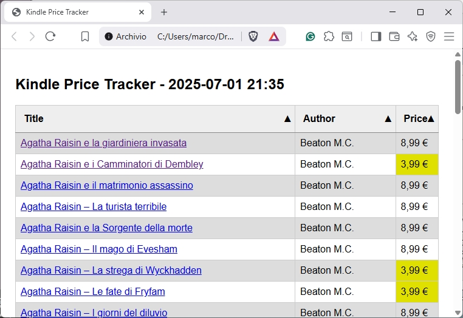

# KindleMostWanted
 a minimal Python script to automatically check price bids for a personal list of Kindle e-books

## Read a CSV, get prices, write a report...

...a really simple tool, to customize and run daily to be sure never to miss the minimum price for an e-book you want to buy, when you don't mind waiting.

The input wanted book list is just a CSV with Author, Title, and URL

```
Author,Title,URL
Beaton M.C.,Agatha Raisin e la giardiniera invasata,https://www.amazon.it/gp/product/B008O620JG
Beaton M.C.,Agatha Raisin e i Camminatori di Dembley,https://www.amazon.it/gp/product/B008DYJW2M
```

Once the program processes it you'll get a secondary CSV with previous price, current price, and a time stamp

```
Author,Book,URL,Previous Price,Current Price,Last Checked
Beaton M.C.,Agatha Raisin e la giardiniera invasata,https://www.amazon.it/gp/product/B008O620JG,"8,99 €","8,99 €",2025-07-01 21:33:22.900384
Beaton M.C.,Agatha Raisin e i Camminatori di Dembley,https://www.amazon.it/gp/product/B008DYJW2M,"3,99 €","3,99 €",2025-07-01 21:33:25.813621
```

and a HTML report - with color alerts and active links.



## Dependencies

**playwright** for page rendering and scraping

**pandas** for CSV handling

**plyer** for minimal notifications
